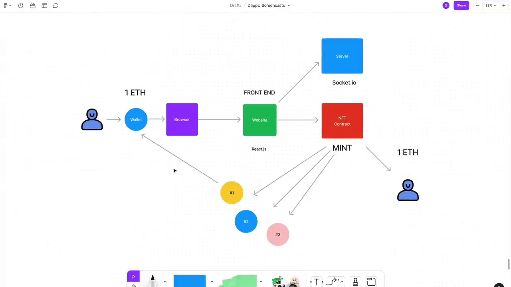

# Notes

## Intro



The messages are not going to blockchain, otherwise it would be too expensive. The messages are going to a server, and the server is going to put the messages in the blockchain.

Using socket.io to send messages to the server.

## ERC20 and ERC721

### Fungible and Non-fungible Tokens

In the context of blockchain and smart contracts, tokens represent a certain asset or utility. They are built on an existing blockchain. There are two main types of tokens: fungible and non-fungible.

Fungible tokens are identical to each other, interchangeable, and each token is exactly the same as every other token; this is why they are fungible. The most common example of fungible tokens is cryptocurrencies like Bitcoin, Ethereum, etc.

Non-fungible tokens (NFTs), on the other hand, are unique and not interchangeable with any other token. They are used to create verifiable digital scarcity. NFTs are used in several specific applications that require unique digital items like crypto art, digital collectibles, and online games.

Here's how you can define a fungible token (ERC20) and a non-fungible token (ERC721) in Solidity:

```solidity
// SPDX-License-Identifier: MIT
pragma solidity ^0.8.9;

import "@openzeppelin/contracts/token/ERC20/ERC20.sol";
import "@openzeppelin/contracts/token/ERC721/ERC721.sol";

// Fungible token
contract

 My

Token is ERC20 {
    constructor(uint256 initialSupply) ERC20("MyToken", "MTK") {
        _mint(msg.sender, initialSupply);
    }
}

// Non-fungible token
contract MyNFT is ERC721 {
    uint256 public tokenCounter;
    constructor () ERC721 ("MyNFT", "MNFT") {
        tokenCounter = 0;
    }

    function createCollectible() public returns (uint256) {
        tokenCounter = tokenCounter + 1;
        _mint(msg.sender, tokenCounter);
        return tokenCounter;
    }
}
```

Please note that you need to install the OpenZeppelin contracts package to use `ERC20` and `ERC721`. You can install it using npm by running `npm install @openzeppelin/contracts`.

### What is interchangeable and non-interchangeable?

"Interchange with other token" typically refers to the ability to exchange one token for another. This is a characteristic of fungible tokens.

In the context of blockchain and cryptocurrencies, a fungible token is one where each unit is identical to every other unit, similar to traditional fiat currencies. For example, one Bitcoin is equivalent to another Bitcoin, and they can be interchanged seamlessly.

This is in contrast to non-fungible tokens (NFTs), where each token is unique and cannot be interchanged on a one-for-one basis with another token. An example of this would be a ticket to a concert - while it's a token that provides access to an event, each ticket is unique because it corresponds to a specific seat at a specific show, and cannot be interchanged directly with another ticket.

In terms of code, whether a token is fungible or not depends on the standard it follows. ERC20 is a standard for fungible tokens, meaning tokens that follow this standard are interchangeable. ERC721 is a standard for non-fungible tokens, meaning each token is unique.
